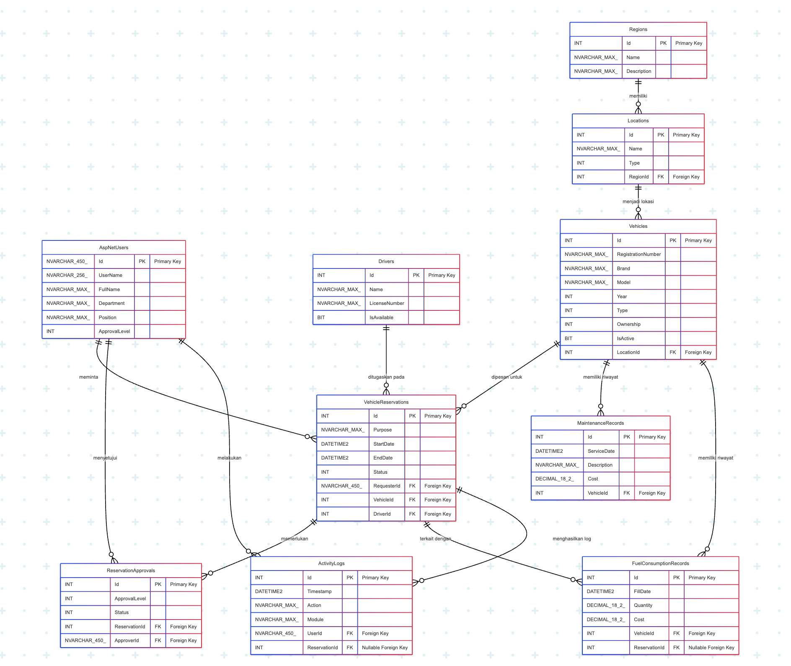

# Manajemen Transportasi Tambang

Sistem Manajemen Transportasi Tambang adalah aplikasi berbasis web untuk mengelola armada kendaraan, driver, konsumsi bahan bakar, reservasi kendaraan, perawatan, dan pelaporan aktivitas transportasi di lingkungan pertambangan.

## Fitur Utama

- **Manajemen Kendaraan**
  - Tambah, edit, hapus, dan lihat detail kendaraan
  - Status kendaraan: aktif, dalam perawatan, tidak aktif
  - Distribusi kendaraan per wilayah/region

- **Manajemen Driver**
  - Tambah, edit, hapus, dan lihat detail driver
  - Status driver: aktif, tidak aktif

- **Reservasi Kendaraan**
  - Pengajuan, persetujuan, dan pelacakan status reservasi kendaraan
  - Riwayat dan status reservasi (Pending, Approved, Rejected, Completed, Cancelled, Partially Approved)

- **Manajemen Konsumsi BBM**
  - Input dan monitoring konsumsi bahan bakar kendaraan
  - Statistik dan tren konsumsi BBM bulanan

- **Perawatan Kendaraan**
  - Jadwal dan riwayat perawatan kendaraan
  - Monitoring perawatan yang akan datang dan overdue

- **Dashboard**
  - Statistik pertumbuhan reservasi, kendaraan, driver, dan konsumsi BBM
  - Grafik tren konsumsi BBM bulanan
  - Distribusi status kendaraan dan reservasi
  - Ringkasan aktivitas terbaru dan perawatan mendatang

- **Laporan & Log Aktivitas**
  - Laporan aktivitas transportasi
  - Log aktivitas pengguna

## Entity Relationship Diagram (ERD)

## Flowchart Sistem

## Teknologi
- ASP.NET Core MVC (.NET 9)
- Entity Framework Core
- MySQL
- Bootstrap, Chart.js, ApexCharts

## Cara Menjalankan
1. Clone repository ini
2. Restore dependencies: `dotnet restore`
3. Update database: `dotnet ef database update`
4. Jalankan aplikasi: `dotnet run`
5. Akses di browser: `http://localhost:5000` (atau port sesuai konfigurasi)

## Struktur Folder Penting
- `Controllers/` : Logic backend (kendaraan, driver, reservasi, dsb)
- `Models/`      : Model data/entitas
- `Views/`       : Tampilan (Razor Pages)
- `Data/`        : Konfigurasi database dan migrasi
- `wwwroot/`     : Asset statis (gambar, css, js)

---
Copyright © Imron Reviady 2025
